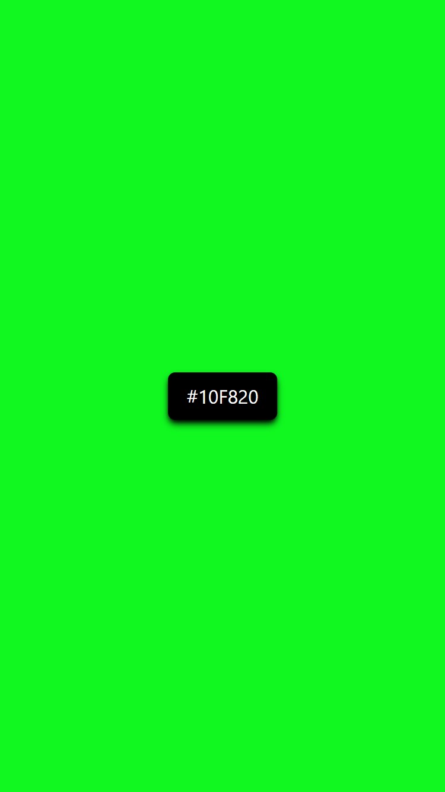

# JavaScript

**Random Background Color Changer using JavaScript DOM**

This feature dynamically changes the background color of a webpage at regular intervals using JavaScript and DOM manipulation. By generating random RGB or HEX color values and applying them to the `document.body.style.backgroundColor`, the background updates automatically. It demonstrates how to interact with and modify the DOM in real-time, providing a simple but effective way to enhance the visual interactivity of a website.

---

### Screenshots

- 

---

### Demo Link

- [Live Demo](https://hexcolorsinbg.netlify.app/)
